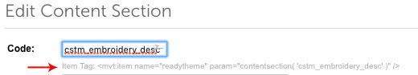

# Service Pages
This is a guide for creating custom service pages within the Miva Admin. We will be using Categories and Readytheme Items.

 **Please note:** These pages are connected to the CTGY_CSTM alternative display page and pull from the customize.css file found under themes/shadows/ui/css/pages/customize.css. Refer to main doc for instructions on how to add a new line of minified css for any additional alternative display pages.

 These categories are skipped in the category tree, as controlled by the page_id for CTGY_CSTM.

**Please review the following before reading this guide**

- https://docs.miva.com/videos/dev-items
- https://docs.miva.com/videos/readytheme
- https://docs.miva.com/reference-guide/css-resources

First, gather the following:

1.The Content Template 

### Content Template:

```html

<div class="o-layout u-grids-2--l o-layout--nowrap--l">
	<div class="x-cstm-content__wrapper o-layout__item">
		<h2 class="x-cstm-header u-font-secondary u-nww-color-secondary u-text-left">
			<mvt:item name="readytheme" param="banner( 'PARENTTOPIC_header_PAGETOPIC' )" />
		</h2>
		<div class="x-cstm-description">
			<mvt:item name="readytheme" param="contentsection( 'PARENTTOPIC_desc_PAGETOPIC' )" />
		</div>
	</div>
	<div class="x-cstm-form__wrapper o-layout__item">
		<mvt:item name="readytheme" param="contentsection( 'cstm_form' )" />
	</div>
</div>


```

2.Know which special elements you will want on this page. This will help to determine which pre-existing content to pull from. (Go to "Service Pages > Components for examples").

It is important to note that what you will be pasting is merely for structure. Structure can change based on the layout. You can create the Readytheme items at anytime. We prefer to create them after the structure is in place for ease of editing. It is easier to see what you are working on when the structure is in place, as opposed to separate pieces. 

## Page Setup
**Step 1**. Navigate to Catalog > Add Category

**Step 2**. Click "+" to create a new category and add a code and category title. We recommend using a common delimiter to group together custom page types (ex: CSTM_).

**Step 3**. Assign the Alternative Display Page "CTGY_CSTM".

**Step 4**. Click the "+ Add" button to create the Category Page

**Step 5**. Paste the Content Template code into the Category header (within "Header & Footer").

**Step 6**. If the structure of the page will be changing (i.e. a 3 column layout vs 1.  More rows? etc), do this first. This will be done via HTML. The classes of "x-cstm-content__wrapper" and "x-cstm-form__wrapper" have custom widths assigned to them and should be updated or not used if changing the structure. 

```html

	3 COLUMNS ON TOP 2 ROWS

	<div class="o-layout">
		<div class="o-layout__item ">
			...
		</div>
		<div class="o-layout__item">
			...
		</div>
		<div class="o-layout__item">
			...
		</div>
	</div>
	<div class="o-layout">
		<div class="o-layout__item">
			...
		</div>
	</div>


	3 COLUMNS ON TOP 3 ROWS

	<div class="o-layout">
		<div class="o-layout__item ">
			...
		</div>
		<div class="o-layout__item">
			...
		</div>
		<div class="o-layout__item">
			...
		</div>
	</div>
	<div class="o-layout">
		<div class="o-layout__item">
			...
		</div>
	</div>
	<div class="o-layout">
		<div class="o-layout__item">
			...
		</div>
	</div>

```

**Step 7**. Go to Readytheme > Banner > Create new banner - this will be the header of your page. We recommend using codes that describe what is being created (ex: cstm_header_newtopic, cstm_desc_newtopic, etc)

- Keep track of the new codes for the items. We find it best to work out of two tabs and copy and paste over updated items as they are created.
- The full item mvt tag can be found under the Readytheme Item code. This is what you will want to paste into your template.




**Step 8**. Create new Readytheme elements based on the needs of the page.

- It is recommended to get all extensions/elements from pre existing templates and then pinpointing what needs to change about the data, this way you are not writing code from scratch.

**Step 9**. Check your work. Load the category in your browser and double check that everything is there (Form? Tables? etc.) and working correctly. (View On Live Store)

**Step 10**. We will assume you are adding on to the Customization template. Assign CSTM_MAIN as the Parent Category.

**Step 11**. Go to CTGY_CSTM > Content. We will be updating the logic for icons.

- Miva will not allow for SVG icon uploads through the admin. We recommend SVG as the preferred icon format, but you can use a PNG. Do not use any other format. Upload the icon to themes/shadows/core/images and assign the icon to its category/page.

```html

	<mvt:if expr="'EMBROIDERY' CIN l.settings:subcategory:code">
		<mvt:assign name="l.settings:subcategory:icon" value="g.theme_path $ '/core/images/cstm_embroidery.svg'" />
	<mvt:elseif expr="'HEATPRESS' CIN l.settings:subcategory:code">
		<mvt:assign name="l.settings:subcategory:icon" value="g.theme_path $ '/core/images/cstm_heatpress.svg'" />
	<mvt:elseif expr="'SCREENPRINT' CIN l.settings:subcategory:code">
		<mvt:assign name="l.settings:subcategory:icon" value="g.theme_path $ '/core/images/cstm_screenprinting.svg'" />
	<mvt:elseif expr="'YOUR NEW CODE' CIN l.settings:subcategory:code">
		<mvt:assign name="l.settings:subcategory:icon" value="g.theme_path $ '/core/images/newicon.svg'" />
	</mvt:if>

```


