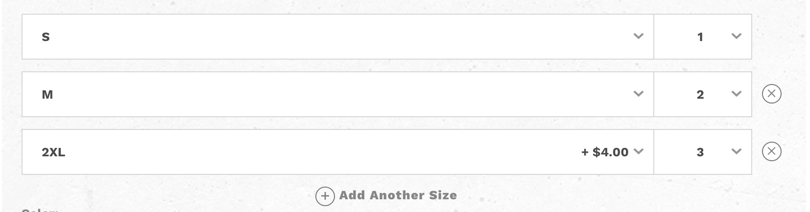
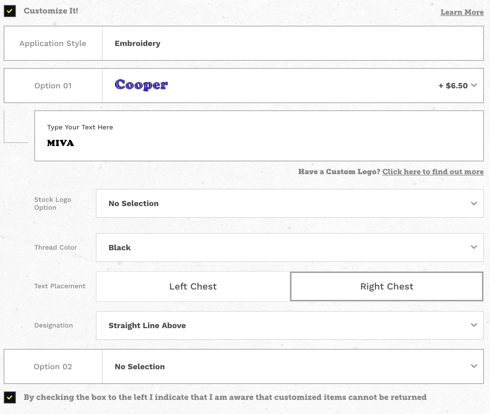

# Product Customizer

The product customizer is a hybrid of Miva's native product layout and Angular. All the attribute data is created through the miva platform and fed to an angular app as json. This app allows the customer to select multiple sizes and also customize their product (like a shirt) with custom lettering.

The angular version of the product page is applied when it either sees an attribute with a prompt of `Size` or attributes with a prefix of `cm`. Customizer templates have been created already so there shouldn't be any issues if a product just has those (no size).

#### Example Product [ video ]
<video controls width="100%">
	<source src="/videos/1-example_prodadd.webm" type="video/webm">
</video>

  

--- 

#### Attributes

##### Multi-Size 

| CODE | PROMPT |
|--|:--:|
| some-code| Size |

* ( ! ) One size attribute per product
* The attribute prompt must always be 'size'

###### Front-End Examples [ img ]

**Above:** One size selected

**Above:** Multiple sizes selected

 

---

##### Customizer 

* **Attr Code Prefix**: `cm_`
	* Attribute templates have been created for:
		* **Embroidery**
			* cm_embroidery
		* **Heat Press**
			* cm_heatpress_cp
			* cm_heatpress_n
		* **Screen Printing**
			* cm_screenprinting

**Reference** the above templates if you need to create your own. 

###### Front-end Example [ img ]

 

> **A product that has customizer attributes should technically have a size attribute as well, but it'll work without.**

 

--- 

#### Wish List (AJAX)

Clicking the wish list button when logged in will add the product to the wish list through AJAX. If a customer has more than one wish list it'll show them a list of available wish lists to pick from.

If a customer is not logged in a login form will appear where they can either login or link to another page to create an account. Once logged in it'll add the item to the wish list. 

>A successful call will result in the wish list button turning/bouncing orange.

##### Example: Angular [ video ]
<video controls width="100%">
	<source src="/videos/2-example_wishlist.webm" type="video/webm">
</video>

>This is also available to basic products (no multi-size/customizer)
 

##### Example: Miva Native [ video ]
<video controls width="100%">
	<source src="/videos/3-example_wishlist.webm" type="video/webm">
</video>

 

----

#### JS Variables Created at runtime

| **mmProductData** |
|---|
| All product data |

| **mmProductAttributes** |
|---|
| All attribute data, used by angular app |

| **mivaPROD** | |
|---|---|
| **base_price** | |
| **price** | |
| **bask** | link |
| **customer** | customer data used to add to wishlist or login|
| **customizationpages** | customization pages : links|
| **acln** | link |
| **logn** | link |
| **wish** | link |
| **wlgn** | link |
| **wlst** | link |

